# Ford Retain

Aplicativo mobile para o dono de um veículo Ford acompanhar a saúde do carro a
partir da leitura dos módulos, receber avisos antes que um item vire problema e
agendar a revisão na rede Ford com preço fechado.

Projeto desenvolvido para a disciplina **Mobile Development & IoT** do curso de
Engenharia de Software (3º ano) da FIAP, no desafio Ford x FIAP. Este documento
corresponde à entrega da **Sprint 3 — Versão final do app com Design System**.

## Sumário

1. [Equipe](#equipe)
2. [Download do APK](#download-do-apk)
3. [O desafio](#o-desafio)
4. [A solução](#a-solução)
5. [Funcionalidades implementadas](#funcionalidades-implementadas)
6. [Telas](#telas)
7. [Design System](#design-system)
8. [Arquitetura e decisões técnicas](#arquitetura-e-decisões-técnicas)
9. [Como executar](#como-executar)
10. [Build do APK](#build-do-apk)
11. [Qualidade de código](#qualidade-de-código)
12. [Entregas da Sprint 3](#entregas-da-sprint-3)
13. [Próximos passos](#próximos-passos)

## Equipe

| Integrante         | RM       |
| ------------------ | -------- |
| Gustavo Morais     | RM554972 |
| Leonardo Scarpitta | RM555460 |
| Murilo Justi       | RM554512 |
| Vitor Eskes        | RM555137 |

## Download do APK

**[Baixar Ford Retain v1.0.0 (APK)](https://github.com/La-Elvis-Tech-2/src-ford-retain-mobile/releases/download/v1.0.0/ford-retain-v1.0.0.apk)**

O arquivo também está disponível na página de
[Releases](https://github.com/La-Elvis-Tech-2/src-ford-retain-mobile/releases)
do repositório. O APK é gerado pelo Expo EAS Build (perfil `preview`) e não é
versionado no Git.

Para instalar em um aparelho Android:

1. Abra o link acima no aparelho e baixe o arquivo.
2. Autorize a instalação de apps de fontes desconhecidas quando o Android pedir.
3. Abra o **Ford Retain**, toque em **Conectar meu Ford** e informe qualquer
   placa válida, antiga (`ABC-1234`) ou Mercosul (`ABC-1D23`).

A placa `AAA-0000` simula uma falha de conexão, para demonstrar o estado de
erro da tela.

## O desafio

Depois do fim da garantia, boa parte dos donos de veículos Ford deixa de fazer
a manutenção na rede de concessionárias. O cliente não sabe em que estado o
carro está até que algo quebre, não tem clareza sobre o preço da revisão e
encontra na oficina independente uma alternativa mais próxima. A rede perde o
relacionamento de pós-venda, e o cliente perde o histórico oficial que valoriza
o carro na revenda.

O desafio é **reter esse cliente no pós-venda**: trazer o dono de volta à rede
Ford no momento certo, com informação clara sobre o carro e um motivo concreto
para escolher a concessionária.

## A solução

O Ford Retain transforma os dados que o próprio veículo já produz em um laudo
de saúde compreensível e em uma ação simples:

- **Saúde do carro em linguagem direta.** Cada componente recebe uma nota de 0
  a 100. As notas formam a saúde de cada sistema (motor, freios, bateria e
  pneus) e a saúde geral do veículo, com a variação da última semana.
- **Aviso antes do problema.** O assistente Ford Assist aborda o dono de forma
  proativa, explica o risco de adiar e mostra quanto custa resolver agora em
  comparação com depois.
- **Revisão com preço fechado.** O orçamento separa peças originais e mão de
  obra, e a escolha da concessionária considera o desvio em relação à rota
  diária do cliente.
- **Histórico que vale dinheiro.** O app registra as revisões feitas na rede e
  mostra o ganho estimado na revenda com o histórico completo.

O app é a continuação, no celular, do laudo web que o cliente recebe por link
no WhatsApp: mesmos dados, mesma tipografia e a mesma identidade visual.

## Funcionalidades implementadas

**Conexão do veículo**

- Tela de abertura com a proposta de valor do app.
- Conexão pela placa, com máscara e validação para os formatos antigo e
  Mercosul, estados de carregamento e de erro.
- Sessão persistida de forma criptografada (`expo-secure-store`): o app reabre
  direto na home enquanto o veículo estiver conectado.
- Rotas públicas e privadas protegidas por guardas de navegação.

**Início**

- Orbe de saúde geral com a variação em relação à semana anterior.
- Os quatro sistemas do veículo com nota, status e tendência.
- Frase do Ford Assist com o item mais importante do momento e atalho para a
  revisão.
- Cartão de procedência com o ganho estimado na revenda, com opções de
  compartilhar (folha de compartilhamento nativa) e ocultar.
- Novidades da rede (recall, campanhas e lançamentos), cada uma com tela de
  detalhe.
- Central de avisos acessada pelo sino, com indicador de não lidos.

**Detalhe do sistema**

- Componentes do sistema com nota, barra de vida útil, medida lida e
  explicação do que acontece se o item for ignorado.
- Atalho para a revisão recomendada.

**Ford Assist (Chat)**

- Três mensagens proativas do assistente, que formam o contador exibido na aba.
- Perguntas sugeridas e campo livre, com indicador de digitação.
- Respostas contextualizadas com o laudo do veículo e botões de ação que levam
  à tela correspondente.

**Revisão**

- Orçamento do pacote recomendado, com a divisão entre peças e mão de obra e o
  custo estimado de adiar o serviço.
- Escolha entre três concessionárias, ordenadas pelo desvio na rota diária.
- Próximos horários livres, calculados a partir dos dias e horários de
  funcionamento de cada concessionária.
- Confirmação em folha inferior com resumo da visita e estado de sucesso.
- Visita marcada exibida no topo da tela, com a opção de remarcar.

**Perfil**

- Dados do cliente e do veículo.
- Selo de procedência e histórico de serviços registrados no chassi.
- Ajustes de alertas e da concessionária preferida.
- Desconexão do veículo, que encerra a sessão e volta para a abertura.

## Telas

### Conexão do veículo

| Abertura | Placa | Erro de conexão |
| :---: | :---: | :---: |
| 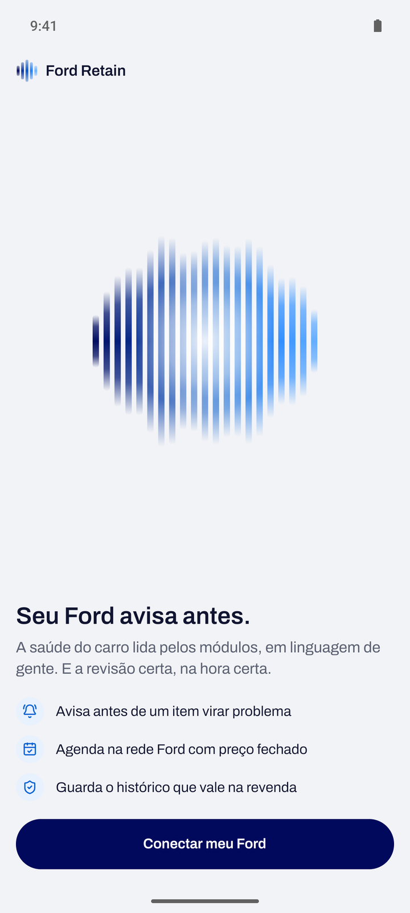 | 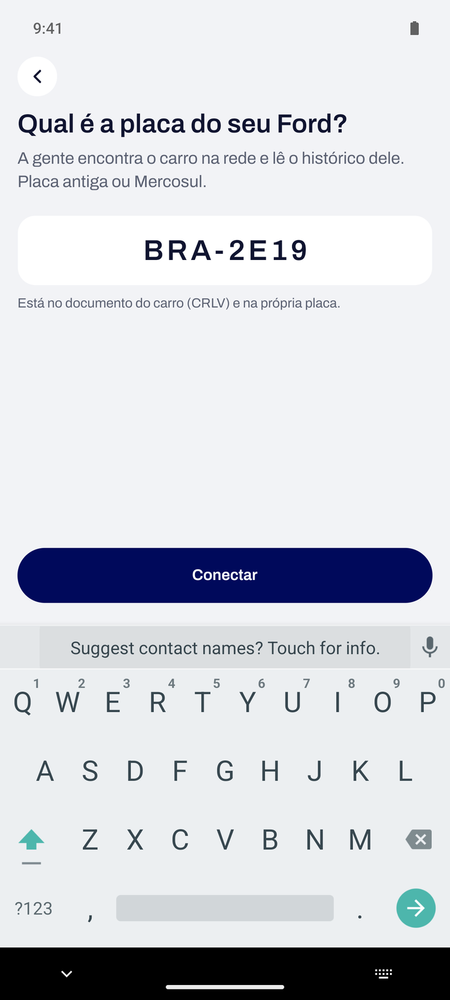 | 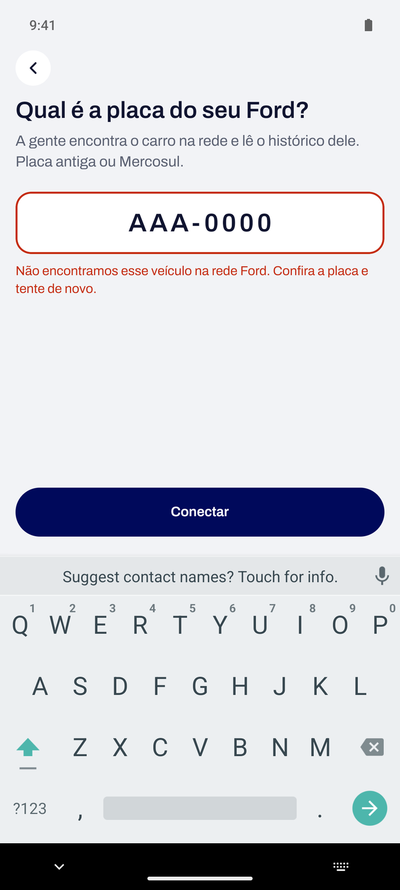 |

### Início

| Painel de saúde | Procedência e novidades | Avisos |
| :---: | :---: | :---: |
| 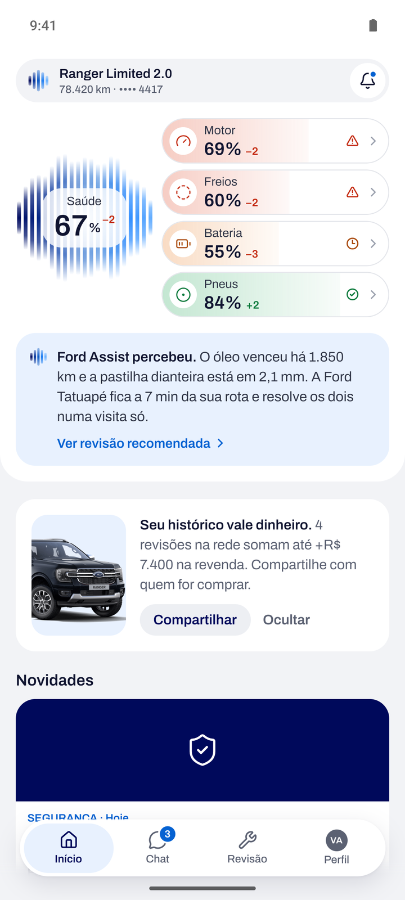 | 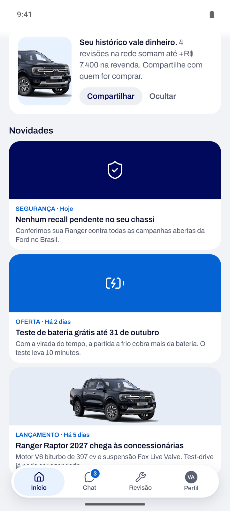 | 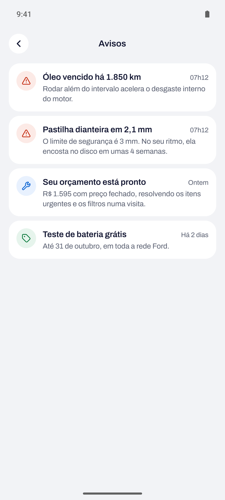 |

| Detalhe do sistema | Detalhe da novidade |
| :---: | :---: |
| 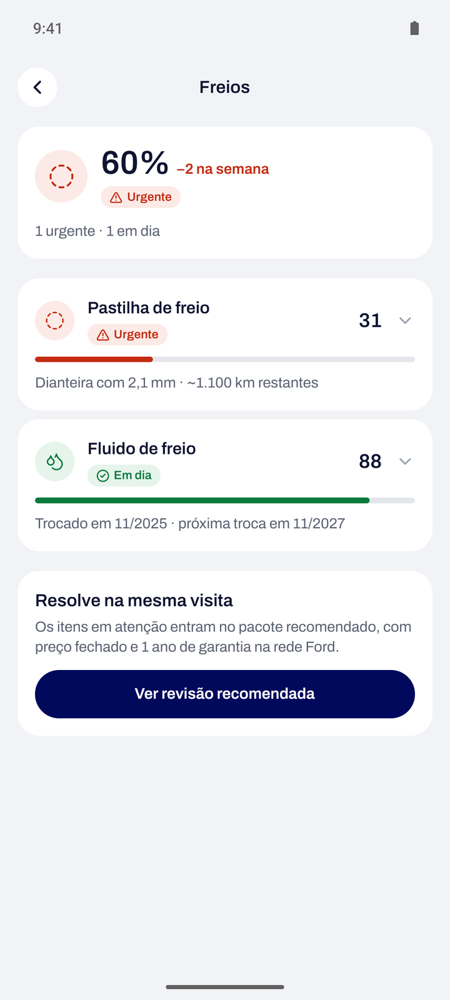 | 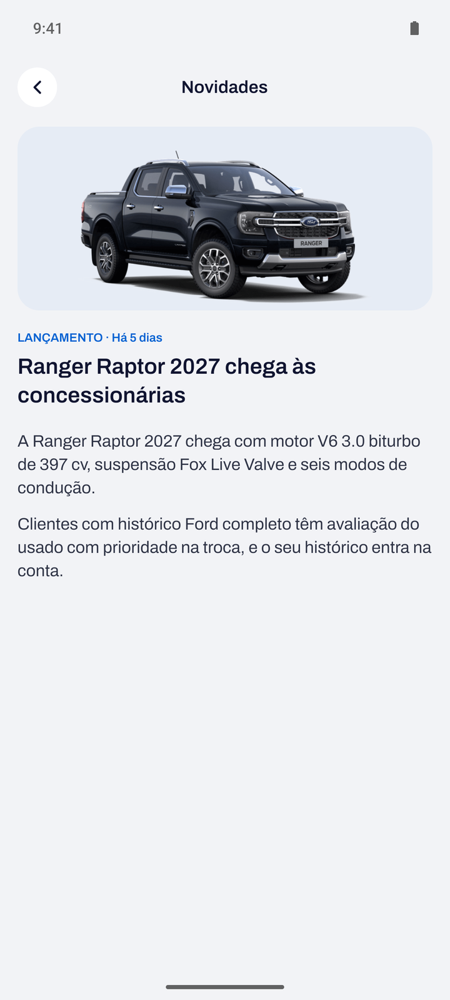 |

### Ford Assist

| Avisos proativos | Resposta com ação |
| :---: | :---: |
| 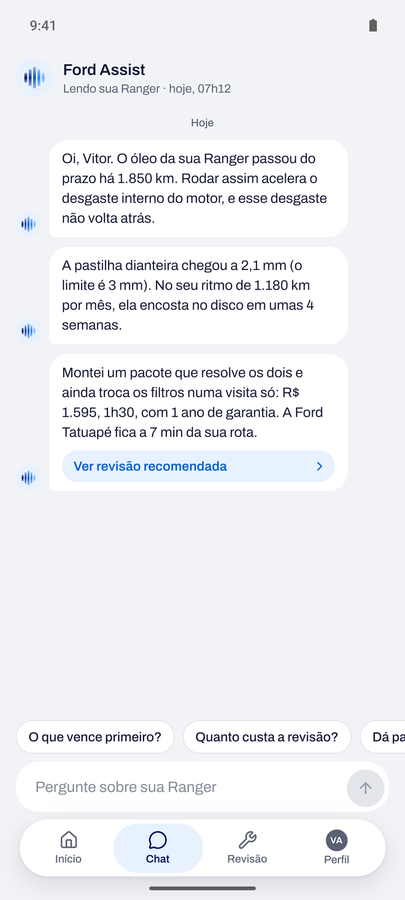 | 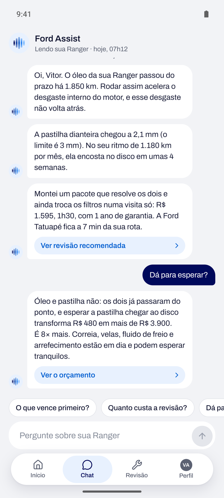 |

### Revisão

| Orçamento | Concessionária e horário | Confirmação |
| :---: | :---: | :---: |
| 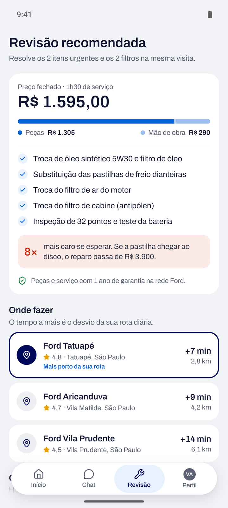 | 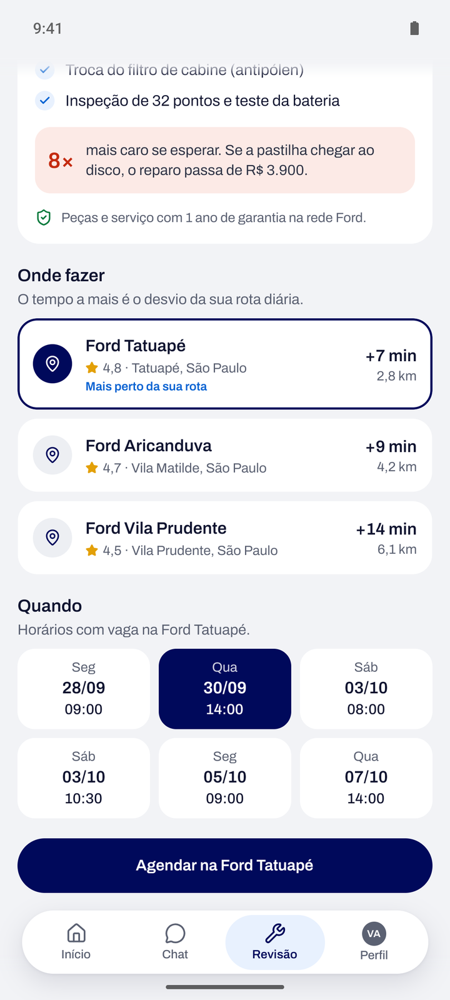 | 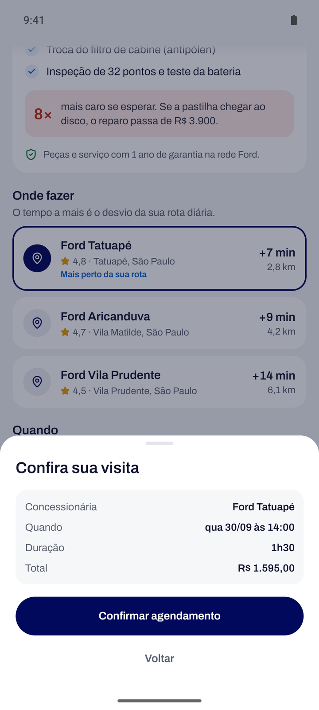 |

| Visita marcada | Revisão agendada |
| :---: | :---: |
| 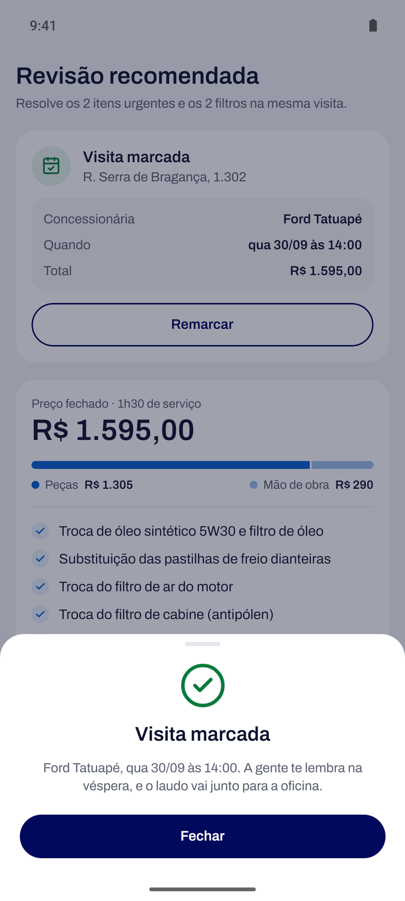 | 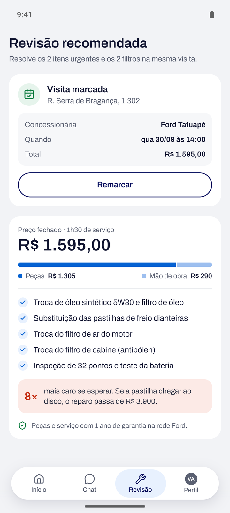 |

### Perfil

| Perfil | Histórico e ajustes |
| :---: | :---: |
| 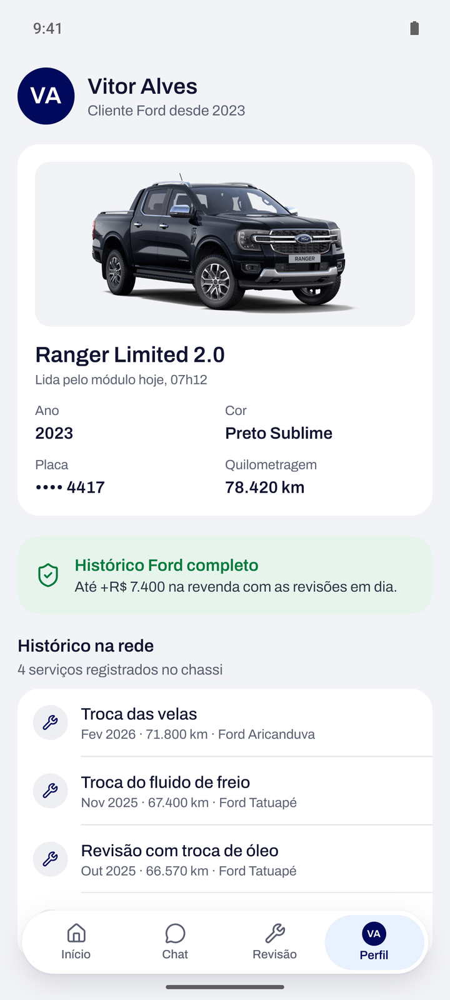 | 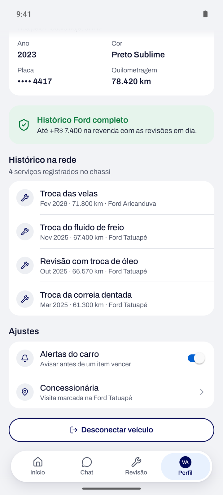 |

## Design System

A identidade visual é definida por tokens em um único lugar e aplicada por
componentes reutilizáveis. Nenhuma tela define cor, fonte ou medida própria.

### Cores

Os tokens ficam em `global.css` (variáveis consumidas pelo NativeWind) e são
espelhados em `src/theme/colors.ts` para as APIs que exigem cor em
hexadecimal, como ícones e SVG.

| Token | Valor | Uso |
| --- | --- | --- |
| `primary` | `#00095B` | Ford Blue: botões principais, ícones e marca |
| `accent` | `#0562D2` | Links, seleção, carregamento e destaques |
| `background` | `#F2F3F6` | Fundo das telas |
| `card` | `#FFFFFF` | Cartões, painel da home e folhas |
| `foreground` | `#101430` | Texto principal |
| `muted-foreground` | `#5B6172` | Texto de apoio |
| `positive` | `#097A3C` | Status em dia e sucesso |
| `warning` | `#A84700` | Status de atenção |
| `negative` | `#C42B10` | Status urgente e erros |

Cada cor de status tem uma variação suave (`*-soft`) para fundos. O status
nunca é comunicado apenas pela cor: sempre acompanha ícone e rótulo.

### Tipografia

Família **Archivo** (Regular, Medium e SemiBold), embarcada no app. A escala é
exposta pelo componente `Text` por variantes:

| Variante | Tamanho / altura de linha | Uso |
| --- | --- | --- |
| `score` | 30 / 34 | Nota de saúde |
| `hero` | 24 / 30 | Título principal da tela |
| `title` | 20 / 26 | Título de seção e de folha |
| `metric` | 18 / 22 | Números em destaque |
| `subtitle` | 16 / 22 | Subtítulo |
| `body` | 15 / 21 | Texto corrido |
| `bodySm` | 14 / 20 | Texto de listas |
| `muted` | 13 / 18 | Texto de apoio |
| `detail` | 12 / 16 | Metadados |
| `caption` | 11 / 14 | Legendas |

O texto acompanha a fonte do sistema até 1,3 vez o tamanho base, o que preserva
a acessibilidade sem quebrar o layout.

### Espaçamento e forma

| Medida | Valor |
| --- | --- |
| Margem lateral das telas | 16 |
| Espaço entre seções | 18 |
| Espaço entre itens | 8 |
| Padding de cartão | 16 |
| Raio de cartão | 20 |
| Raio do painel da home | 28 |

As medidas foram desenhadas para uma largura de 393 pt. Em telas mais estreitas,
um fator de escala único (mínimo de 0,9) reduz todas as medidas de forma
proporcional para que a composição continue cabendo.

### Componentes

| Componente | Responsabilidade |
| --- | --- |
| `Text` | Escala tipográfica, cor e limite de escala de fonte |
| `Button` | Variantes `primary`, `secondary`, `outline` e `ghost`, três tamanhos, estados de carregamento e desabilitado |
| `Card` | Superfície branca com raio e padding padronizados |
| `Sheet` | Folha inferior para confirmações |
| `PressableScale` | Resposta de toque com escala animada e retorno háptico |
| `IconDisc`, `Avatar` | Ícones e iniciais em disco |
| `SectionHeader` | Título e subtítulo de seção |
| `QueryState` | Estados de carregamento e de erro com nova tentativa |
| `Screen`, `ScreenScrollView`, `ScreenHeader` | Estrutura de tela, área segura, rolagem e cabeçalho com voltar |
| `TabBar` | Barra de abas flutuante com indicador animado e contador |
| `BrandMark`, `HealthOrb` | Marca do app e orbe de saúde |

### Estados de interação

| Estado | Onde aparece |
| --- | --- |
| Carregando | Indicador nos blocos que dependem do laudo; botões com indicador durante conexão, agendamento e desconexão; indicador de digitação no chat |
| Erro | Mensagem com "Tentar de novo" quando o laudo não carrega; erro de placa; falha ao reservar horário; tela de erro global e rota inexistente |
| Vazio | Central de avisos sem itens; botão de agendar desabilitado até a escolha de um horário |
| Sucesso | Confirmação animada da visita marcada; retorno háptico na conexão e no agendamento |

## Arquitetura e decisões técnicas

### Tecnologias

| Camada | Tecnologia |
| --- | --- |
| Plataforma | Expo SDK 57, React Native 0.86, React 19.2 |
| Linguagem | TypeScript 6 em modo estrito |
| Navegação | Expo Router com rotas tipadas |
| Estilo | NativeWind 4 (Tailwind CSS 3) com tokens em CSS |
| Estado da aplicação | Zustand |
| Dados do servidor | TanStack Query |
| Animações | React Native Reanimated 4 |
| Gráficos e marca | React Native SVG |
| Armazenamento seguro | Expo Secure Store |
| Ícones | Lucide |
| Qualidade | Biome (lint e formatação) |
| Build | Expo EAS Build |

### Decisões

- **Organização por funcionalidade.** Cada domínio (`auth`, `vehicle`, `home`,
  `assistant`, `service`, `news`, `notifications`, `profile`) reúne seus
  componentes, hooks, dados, stores e serviços. Os arquivos em `app/` apenas
  declaram a rota e reexportam a tela.
- **Contrato de serviço com duas implementações.** Cada serviço que fala com o
  servidor tem uma interface, uma implementação simulada e uma implementação
  HTTP. A variável `EXPO_PUBLIC_API_URL` decide qual é usada. Sem ela, o app
  funciona inteiro sobre dados simulados; com ela, passa a consumir a API sem
  alteração nas telas.
- **Separação entre estado da aplicação e dados do servidor.** Zustand guarda a
  sessão, a conversa do assistente, a visita marcada e os avisos lidos. O
  TanStack Query cuida do laudo, com cache compartilhado: home, detalhe,
  perfil e assistente mostram sempre os mesmos números a partir de uma única
  requisição.
- **Sessão segura e guardas de rota.** A sessão fica no Keystore do Android e
  no Keychain do iOS. O layout raiz restaura a sessão antes de decidir a rota,
  e a tela de abertura nativa permanece visível até lá, o que evita que a tela
  de login pisque para quem já está conectado.
- **Regras de saúde centralizadas.** `src/features/vehicle/health.ts` concentra
  todas as contas: abaixo de 40 o item é urgente, abaixo de 75 pede atenção e
  o restante está em dia. A nota de um sistema é a média dos componentes, e a
  cor do sistema é o pior status entre eles.
- **Resiliência.** Um `ErrorBoundary` global evita tela branca em caso de erro
  de renderização; falhas de leitura do armazenamento seguro não prendem o app
  na abertura; erro de rede no logout não impede a desconexão.
- **Acessibilidade.** Papéis e rótulos de acessibilidade em elementos
  interativos, status sempre com ícone e texto, contraste validado para os
  textos e respeito à escala de fonte do sistema.
- **Recursos nativos.** Retorno háptico (`expo-haptics`), folha de
  compartilhamento nativa, teclado ajustado por plataforma, ícone adaptativo com
  versão monocromática para os ícones temáticos do Android 13 ou superior.
- **Build reproduzível.** O EAS Build gera o APK a partir do repositório, com a
  keystore gerenciada pelo Expo e a versão do app controlada remotamente.

### Estrutura

```
app/                        rotas do Expo Router
  (public)/                 abertura e conexão pela placa
  (private)/                exige sessão
    (tabs)/                 Início, Chat, Revisão e Perfil
    system/[systemId].tsx   detalhe de um sistema
    news/[newsId].tsx       detalhe de uma novidade
    notifications.tsx       central de avisos
assets/images/              ícone, splash e imagens do veículo
src/
  components/
    brand/                  marca do app
    layout/                 tela, rolagem, cabeçalho e barra de abas
    ui/                     componentes do Design System
  features/
    auth/                   sessão, conexão pela placa e validação
    vehicle/                laudo, regras de saúde, orbe e detalhe
    home/                   tela inicial e seus cartões
    assistant/              Ford Assist
    service/                orçamento, concessionárias, agenda e reserva
    news/ notifications/ profile/
  services/                 cliente HTTP e armazenamento seguro
  theme/                    cores, fontes, medidas, escala e degradês
  lib/ hooks/ routes/ providers/ config/
```

## Como executar

Pré-requisitos: Node.js 20.19.4 ou superior e pnpm 10.

```bash
pnpm install
pnpm start
```

Com o servidor do Expo rodando, abra o app no Expo Go ou em um emulador
Android (`a` no terminal). Para apontar para uma API real, copie
`.env.example` para `.env` e preencha `EXPO_PUBLIC_API_URL`.

| Script | Função |
| --- | --- |
| `pnpm start` | Inicia o servidor de desenvolvimento |
| `pnpm android` | Inicia e abre no Android |
| `pnpm typecheck` | Verificação de tipos |
| `pnpm lint` | Lint e formatação com Biome |
| `pnpm check` | Tipos e lint em sequência |
| `pnpm doctor` | Diagnóstico do projeto Expo |

## Build do APK

O APK é gerado pelo Expo EAS Build com o perfil `preview`, definido em
`eas.json`:

```bash
eas build --platform android --profile preview
```

Ao final, o EAS disponibiliza o arquivo para download. A versão distribuída é
publicada na página de Releases do repositório.

## Qualidade de código

- `pnpm typecheck` e `pnpm lint` passam sem erros ou avisos.
- `expo-doctor` aprova as 21 verificações do projeto.
- O APK de release foi instalado e testado em emulador Android 15, cobrindo
  todas as telas documentadas acima.
- Commits seguem o padrão Conventional Commits (`feat`, `fix`, `build`,
  `docs`, `chore`).

## Entregas da Sprint 3

- **Design System consolidado.** Cores, tipografia e medidas centralizadas em
  tokens, componentes reutilizáveis em todas as telas e estados de
  carregamento, erro, vazio e sucesso padronizados.
- **Identidade no aparelho.** Ícone do app, ícone adaptativo com versão
  monocromática e tela de abertura nativa com a marca do Ford Retain.
- **Build de release.** APK gerado pelo EAS Build e validado em emulador
  Android 15 (Pixel 7), percorrendo todos os fluxos do início ao fim.
- **Correções encontradas no teste do APK de release:**
  - o indicador de digitação do Ford Assist encerrava o app, porque uma função
    JavaScript era chamada dentro de um worklet do Reanimated, o que o build de
    release não permite;
  - no Android com edge-to-edge, o teclado cobria o botão "Conectar" e o campo
    do chat, pois a janela deixou de ser redimensionada; as duas telas passaram
    a usar um componente comum que desloca o conteúdo;
  - textos centralizados ou posicionados ao lado de outro elemento perdiam a
    última palavra no Android por arredondamento de largura; esses textos
    passaram a ocupar a largura do contêiner.

## Próximos passos

- Integrar o laudo com os dados reais de veículos conectados Ford, usando a
  camada HTTP que já existe em cada serviço.
- Substituir as respostas por regras do Ford Assist por um modelo de linguagem
  que leia o laudo completo.
- Enviar os avisos proativos como notificações push.
- Consultar a agenda real das concessionárias e traçar a rota em mapa.
- Suporte offline, pausando as consultas sem conexão.
- Testes automatizados das regras de saúde e da agenda, e testes de ponta a
  ponta dos fluxos principais.
- Distribuição para iOS pelo TestFlight.
